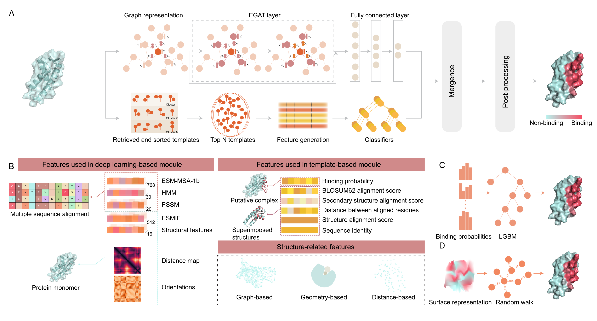

# Description
NABind is a novel structure-based method to predict DNA/RNA-binding residues by leveraging deep learning and template approaches.  
  

# Third-party software
PSI-BLAST https://ftp.ncbi.nlm.nih.gov/blast/executables/blast+/LATEST/  
HH-suite https://github.com/soedinglab/hh-suite  
GHECOM https://pdbj.org/ghecom/  
TM-align https://zhanggroup.org/TM-align/  
NW-align https://zhanggroup.org/NW-align/  
CD-HIT https://github.com/weizhongli/cdhit/releases  
DSSP https://swift.cmbi.umcn.nl/gv/dssp/DSSP_5.html  
NACCESS http://www.bioinf.manchester.ac.uk/naccess/  

# Database requirement
UniRef90 https://www.uniprot.org/help/downloads  
Uniclust30 https://uniclust.mmseqs.com/  
Manually created template library pass

# Important python packages
Numpy  
Pandas  
Biopython  
Scipy  
read_cdhit  
fair-esm  
pytorch  
DGL  
GraphRicciCurvature  

# Usage
## 1. Download pre-trained models
The pre-trained models can be found at https://drive.google.com/drive/folders/1TOp5xAqd5Wf_RpubCyrhouU_sX4FXLov?usp=sharing  
## 2. Configuration
Download and install the third-party software listed above.  
Change the paths of these softwares and related databases at config/config.json
## 3. Prediction
Run the following command:  

    python predict.py --pdb ./demo/6chv_D.pdb --outdir ./demo/ --type DNA --structure native

Type -h for help information:

    python predict.py -h
    
# Citation
pass  
